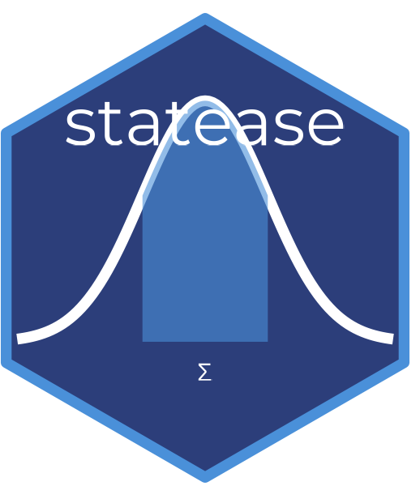

# statease 

> Simplified statistical analysis with plain-English interpretation for R

## Overview

**statease** is an R package that runs descriptive statistics, t-tests, 
and ANOVA — and tells you in plain English what the results mean.
No more copy-pasting output into interpretation guides.
One function call gives you the full picture.

## Installation

Once published to CRAN:
```r
install.packages("statease")
```

For the development version from GitHub:
```r
# install.packages("devtools")
devtools::install_github("DevWebWacky/statease")
```

## Functions

| Function | What it does |
|---|---|
| `analyze()` | Master function — auto-detects and runs the right test |
| `describe()` | Descriptive statistics with interpretation |
| `ttest_interpret()` | T-tests with Cohen's d and CI interpretation |
| `anova_interpret()` | ANOVA with Tukey post-hoc and eta squared |
| `interpret_p()` | Standalone p-value interpreter |

## Usage

### One command does it all
```r
library(statease)

# Descriptive statistics
analyze(x = c(23, 45, 12, 67, 34), var_name = "Exam Scores")

# Independent samples t-test (auto-detected)
analyze(x = c(23,45,12,67,34), y = c(19,38,22,51,29), var_name = "Scores")

# One-way ANOVA (auto-detected)
df <- data.frame(
  score = c(23,45,12,67,34,89,56,43,78,90,11,34),
  group = rep(c("A","B","C"), each = 4)
)
analyze(formula = score ~ group, data = df)

# Interpret any p-value
interpret_p(0.03, context = "treatment vs control group")
```

## Why statease?

Most R output gives you numbers. statease gives you **numbers + meaning**.
Perfect for:
- 📚 Students learning statistics
- 🔬 Researchers who want fast readable output
- 🏫 Educators teaching statistical concepts

## License
MIT
